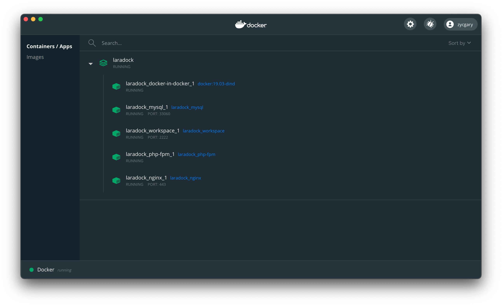
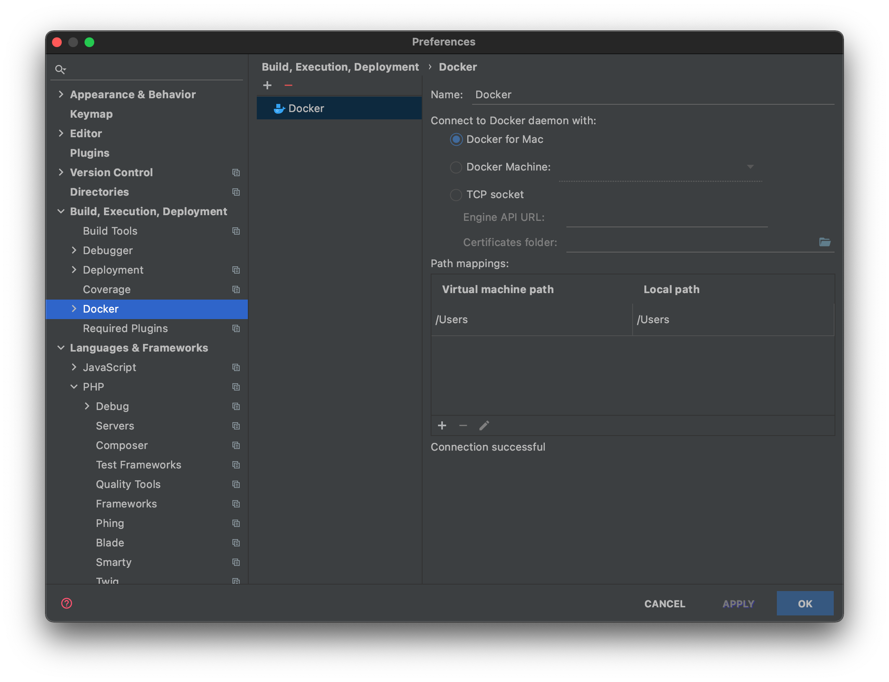
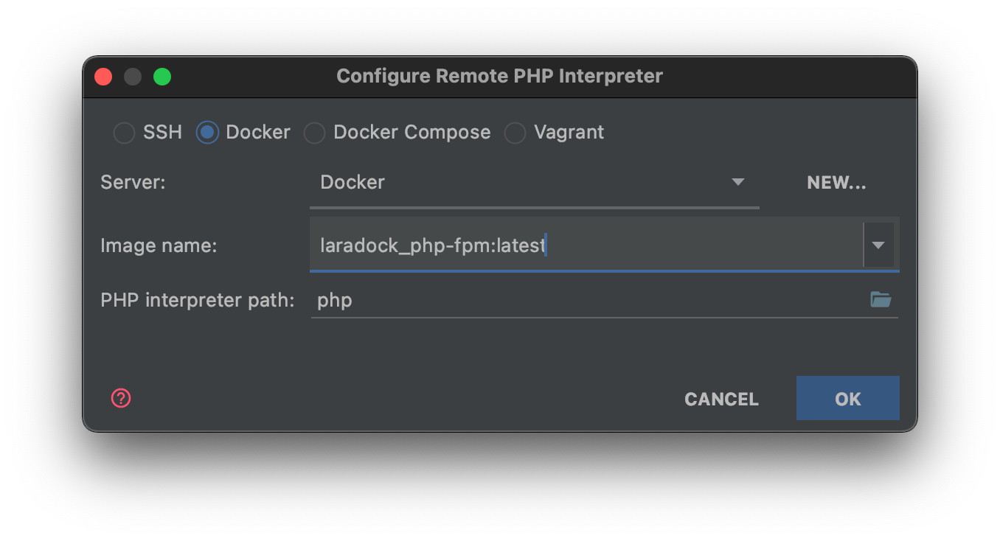
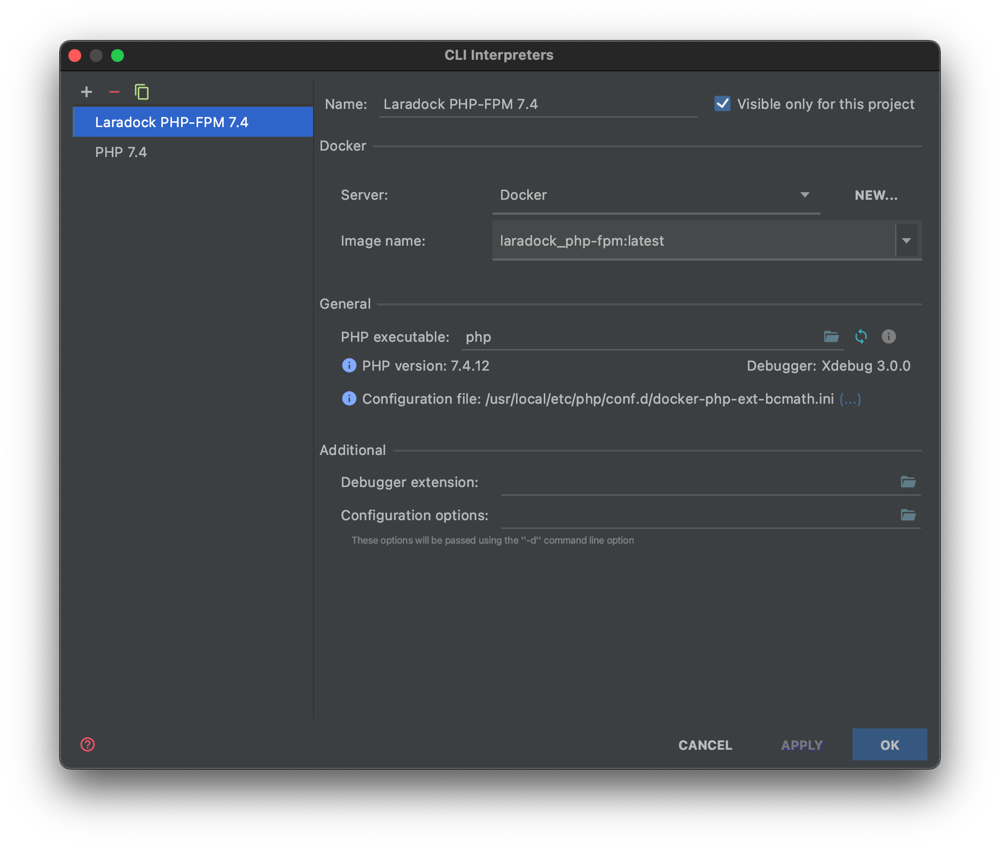
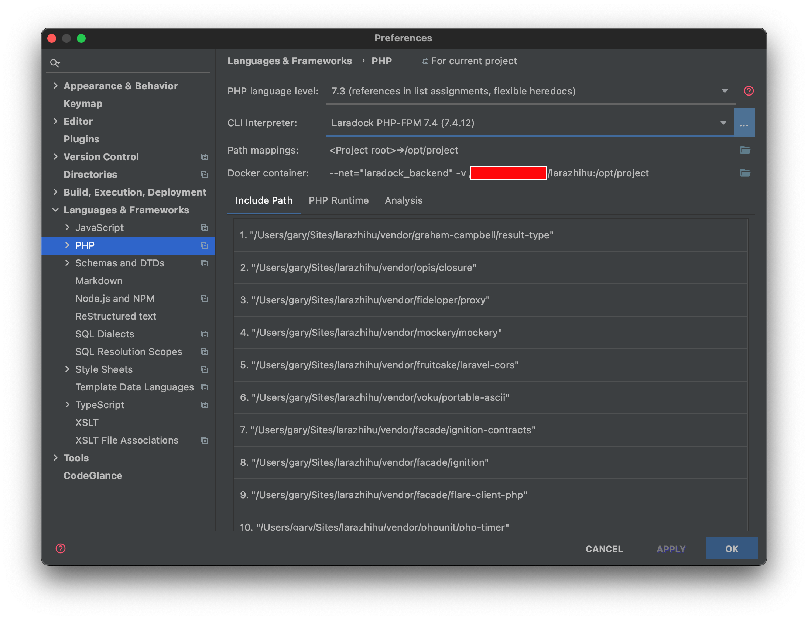
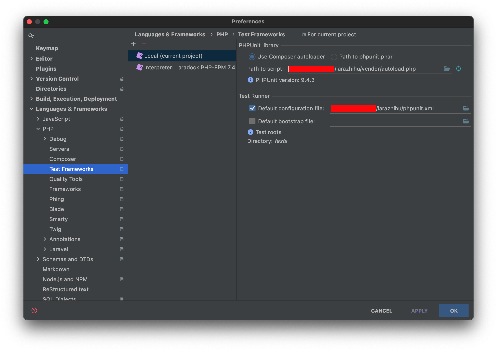
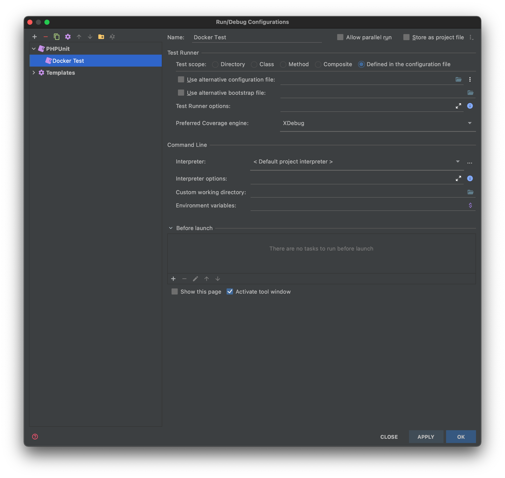

# larazhihu

## Installation
1. Clone the repository with **laradock** submodule
    ```bash
    git clone --recurse-submodules https://github.com/ZYCGary/larazhihu
    ```
    Then a Laradock repository should be installed as a submodule in this project, located under */laradock*.

2. Setup docker: Follow the [Usage Guide](https://laradock.io/getting-started/#Usage) to run docker.

    (In this project, only **mysql**, **nginx** and **php-fpm(7.4)** will be used)
    
## Develop using Docker for Mac + PHPStorm + PHPUnit
1. Open **Dashboard** of Docker for Mac and check laradock is running
    

2. Configure the Docker daemon connection settings:
    * In the Settings/Preferences dialog `⌘,`, select *Build, Execution, Deployment | Docker*.
    * Click `+` button to add a Docker configuration and specify how to connect to the Docker daemon.
    
    * The *Connection successful message* should appear at the bottom of the dialog.
    

3. Add PHP interpreter:
    * Select *Languages & Frameworks > PHP*
    * Click the `…` button next to the *CLI Interpreter* drop down
    * click the `+` button to add a new interpreter and select *From Dock, Vagrant, VM, WSL, Remote...*
    * Pick the *Docker* configuration, and then the image for the container that has PHP install, plus the path on the container to find the PHP executable.
    
    * Click OK, you should see the new interpreter configured correctly and available to select.
    
    * Click OK and back to the PHP configuration dialog.
    * Click the `folder` icon of the *Docker container*. Inside opened dialog, you will find *links* section, Set *Network mode* to "laradock_backend".
      (the network mode may be different, you can check your network by running following command from the CLI
      ```bash
      docker network ls
      ```
    * Click OK, then your PHP configuration dialog should be like this:
    
    * Now you have the remote interpreter configured, you can use it as usual in any of the places you’d typically set an interpreter, including our test runner (PHPUnit, PhpSpec, Behat), code quality tools (PHPCS and PHPMD), and debugging.    
4. Configure PHPUnit
    * Select *Languages & Frameworks > PHP > Test Frameworks*
    * Create a new configuration by clicking the `+` and selecting *By Remote Interpreter* and then picking the interpreter configured earlier.
    * Because PHPUnit is installed here using composer, I can just tell PhpStorm where to find the Composer autoloader as a local path on the container. Notice how we have a mapping from the project root to `/opt/project`.
    * Check *Default configuration file* and type the path to phpunit.xml (note that paths in this dialogue are relative to the host machine — not the container)
    
    * Click OK
    
5. Add a run configuration for PHPUnit
    * Click the *Edit Configurations* option from the *Run* dropdown menu
    * Add a new configuration using the `+` button, and selecting *PHPUnit*
    
6. Now, you can save the settings and run the test runner using the green play icon, or test any testing function by clicking the green play button next to it.


